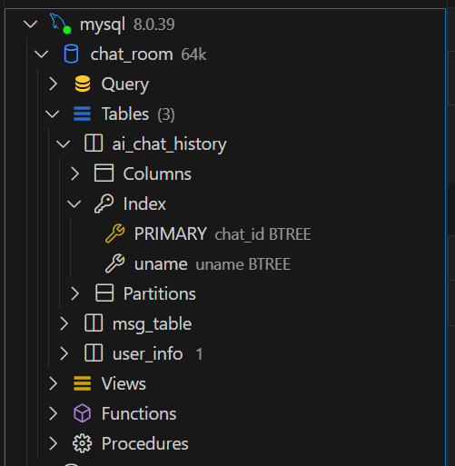
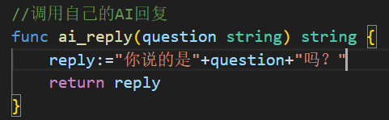

# open_fande_chat_room

### 介绍
###### 没咋写注释，那样有点累:joy:，一个比较简单的ai聊天室。
还有很多功能待实现,也还要许多可以优化的地方，特别是数据库查询优化和前端ui。

### 软件架构
go语言gin框架+mysql数据库+websocket+jwt验证+前端无框架HTML/javascript
### 安装教程

1.  最好安装golang环境，不安装也行（但是这样就不能自己修改后端go代码）。<br>不安装的话直接运行**exe文件**(windows环境)/**二进制文件**(linux环境)就行。
2.  配置mysql数据库。
3.  配置自己的ai聊天接口。

完成以上三步就ok了，感兴趣的话可以部署在一个服务器上，支持多人聊天，ai聊天。
**突然想起来，要想注册用户的话得先在数据库中加入一条用户，然后用邀请码邀请别人注册，鼠标停留在猫meme头像那个位置会显示邀请码。**

### 使用说明

#####  1.golang环境配置(录了视频，改天把网址传上来)。
安装好后``go mod tidy``之后直接``go build`` 编译运行。
##### 2.mysql数据库配置:
###### 具体结构：
###### user_info表结构：(user information) 
存储用户信息，正常应该用一个hash函数之类的单向的加密算法加密密码，这里为了方便就直接存明文了，有兴趣的可以去优化优化。
```
CREATE TABLE user_info (
  uname varchar(255) NOT NULL,
  passwd varchar(31) NOT NULL,
  PRIMARY KEY (uname)
)
```
###### msg_table表结构：(message table)
```
| msg_table | CREATE TABLE `msg_table` (
  `uname` varchar(255) NOT NULL,
  `create_time` datetime NOT NULL COMMENT 'Create Time',
  `msg` varchar(511) NOT NULL,
  PRIMARY KEY (`uname`,`create_time`),
  CONSTRAINT `msg_table_ibfk_1` FOREIGN KEY (`uname`) REFERENCES `user_info` (`uname`) 
) ENGINE=InnoDB DEFAULT CHARSET=utf8mb4 COLLATE=utf8mb4_0900_ai_ci |
```
###### ai_chat_history表结构：(ai chat history)
最好在uname字段上建立索引，提高查询效率。
```
| ai_chat_history | CREATE TABLE `ai_chat_history` (
  `chat_id` int NOT NULL AUTO_INCREMENT,
  `uname` varchar(255) NOT NULL,
  `msg` varchar(10240) NOT NULL,
  `speaker` varchar(255) NOT NULL,
  `chat_time` datetime(3) NOT NULL,
  PRIMARY KEY (`chat_id`),
  KEY `uname` (`uname`)
) ENGINE=InnoDB AUTO_INCREMENT=53 DEFAULT CHARSET=utf8mb4 COLLATE=utf8mb4_0900_ai_ci |
```
##### 3.配置自己的ai聊天接口:
找到``route.go``文件，修改``ai_reply()``函数，调用你自己的ai接口，返回字符串即可,这个网上教程很多的。
我只是做了一个简单的demo，返回了一个固定字符串：


### 仓库地址

###### [gitee](https://gitee.com/wlw_wlw/openfound_test.git): 
`https://gitee.com/wlw_wlw/openfound_test.git`

###### [github](https://github.com/wlw-wlw-wlw/open_funde_chat_room.git):
`https://github.com/wlw-wlw-wlw/open_funde_chat_room.git`

